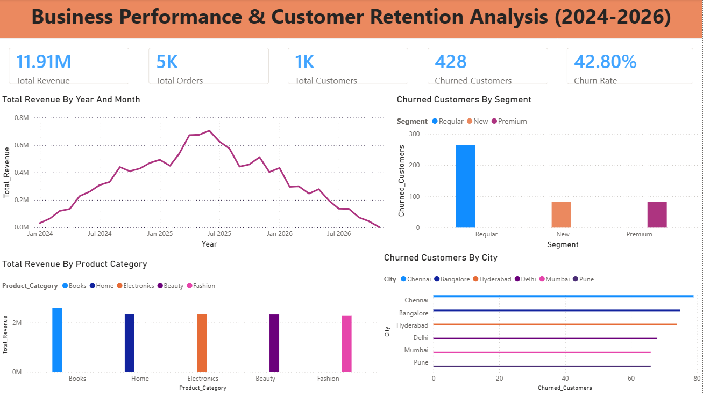
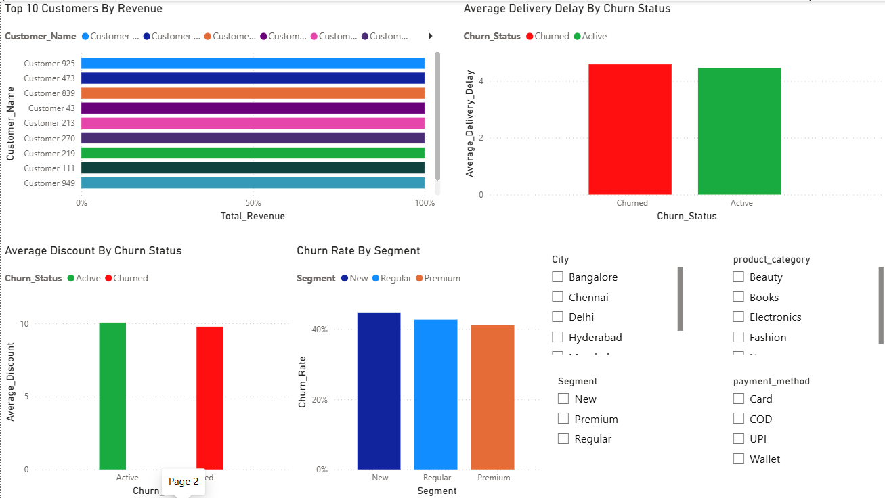

# E-Commerce Customer Churn Analysis

## 📌 Project Overview

This project analyzes customer churn for an e-commerce business using customer and order data.

The objective is to identify customers who are likely to churn, understand the factors associated with churn, analyze customer segments and purchasing behavior, and provide business insights that can help improve customer retention.

The project follows an end-to-end data analytics workflow:

**Data Cleaning → SQL Analysis → Exploratory Data Analysis → Power BI Dashboard → Business Insights**

---

## 🎯 Business Problem

The e-commerce business has experienced customer churn and wants to understand:

- Which customer segments have the highest churn?
- Which cities contribute the most churned customers?
- Do delivery delays influence customer churn?
- Does discount level differ between active and churned customers?
- Which product categories generate the most revenue?
- Who are the highest-value customers?
- How is revenue changing over time?
- What actions can the business take to improve customer retention?

---

## 🛠️ Tools & Technologies

- **MySQL** – Data cleaning, transformation, SQL analysis and exploratory analysis
- **Power BI** – Interactive dashboard and data visualization
- **Microsoft Excel** – Initial data inspection and preparation
- **GitHub** – Project documentation and version control

---

## 📊 Dataset

The project uses e-commerce customer and order data containing information such as:

### Customer Data
- Customer ID
- Customer Name
- Age
- Gender
- City
- Customer Segment
- Signup Date

### Order Data
- Order ID
- Customer ID
- Order Date
- Product Category
- Order Value
- Discount
- Shipping Days
- Payment Method
- Returned Status

### Customer Churn Data
- Customer ID
- Last Purchase Date
- Total Orders
- Total Spend
- Average Delivery Delay
- Support Tickets
- Churn Status

---

## 🧹 Data Cleaning

The data was cleaned and prepared before analysis.

Key steps included:

- Checking for duplicate records
- Checking for missing values
- Validating customer IDs
- Standardizing data types
- Checking date fields
- Validating numerical columns
- Creating customer-level churn data
- Joining customer and order information
- Preparing analysis-ready tables

---

## 🔍 SQL Analysis & Exploratory Data Analysis

MySQL was used to perform exploratory analysis and answer key business questions.

The analysis included:

- Churn rate by customer segment
- Churned customers by city
- Average delivery delay by churn status
- Average discount by churn status
- Revenue by product category
- Top 10 customers by revenue
- Monthly revenue trends
- Monthly churn trends
- Repeat purchase analysis
- Customer Lifetime Value analysis
- RFM analysis

---

## 📈 Power BI Dashboard

An interactive Power BI dashboard was created to provide a business-level view of customer churn and revenue performance.

### Key KPIs

- Total Revenue
- Total Orders
- Total Customers
- Churned Customers
- Churn Rate

### Dashboard Analysis

The dashboard provides visual analysis of:

- Total Revenue by Year and Month
- Churned Customers by Segment
- Churned Customers by City
- Top 10 Customers by Revenue
- Revenue by Product Category
- Average Delivery Delay by Churn Status
- Average Discount by Churn Status

Interactive slicers allow users to analyze the dashboard by dimensions such as:

- City
- Customer Segment

---

## 💡 Key Business Insights

The analysis identified several important customer and business patterns.

### 1. Overall Churn

Customer churn is approximately **42.8%**, indicating a significant customer retention challenge and a need for stronger retention strategies.

### 2. Customer Segment

**Premium customers have the lowest churn rate**, suggesting stronger engagement and loyalty among higher-value customers.

### 3. City-Level Churn

**Chennai contributes the highest number of churned customers**, making it a priority for further investigation and targeted customer-retention campaigns.

### 4. Delivery Delay

Churned and active customers were compared based on average delivery delay. Monitoring delivery performance can help identify whether differences in shipping experience may be associated with customer churn.

### 5. High-Value Customers

The **top 10 customers contribute a significant share of total revenue**. These customers should be considered high-value accounts and prioritized for loyalty and retention initiatives.

### 6. Product Categories

**Revenue varies considerably across product categories.** High-revenue categories should be monitored closely and considered for targeted promotions and cross-selling opportunities.

---

## 📌 Business Recommendations

Based on the analysis, the following actions are recommended:

- **Target At-Risk Customers:** Use churn indicators to identify customers who may be likely to stop purchasing and target them with personalized retention campaigns.

- **Improve Delivery Experience:** Monitor shipping delays and investigate locations or orders where delivery performance is consistently poor.

- **Protect High-Value Customers:** Create loyalty benefits and personalized offers for high-value and frequent customers.

- **Segment-Based Marketing:** Use customer segments to create different marketing strategies rather than sending the same promotion to every customer.

- **Optimize Discounts:** Use customer behavior and churn risk to provide targeted offers instead of giving discounts broadly.

- **Monitor Churn Regularly:** Track churn rate, revenue, repeat purchases, and customer behavior through the Power BI dashboard so changes can be identified early.

---

## 📂 Project Structure

```text
E-Commerce-Customer-Churn-Analysis/
│
├── README.md
│
├── data/
│   ├── customer_churn.csv
│   ├── customers.csv
│   └── orders.csv
│
├── sql/
│   └── churn_analysis.sql
│
├── powerbi/
│   └── E-Commerce-Customer-Churn-Dashboard.pbix
│
└── screenshots/
    ├── Dashboard_Overview.png
    └── Customer_Churn_Analysis.png
```

## 📊 Power BI Dashboard

The interactive Power BI dashboard analyzes customer churn, revenue performance, customer segments, delivery delays, discounts, cities, and product categories.

### Dashboard Preview





### Power BI Dashboard File

[Open Power BI Dashboard](./powerbi/E-Commerce-Customer-Churn-Dashboard.pbix)
